  #  INTRODUCTION
   ### Welcome to the official repository for the University of Ghana Department of Computer Science website. This project represents a comprehensive web solution I developed using HTML, CSS, and JavaScript to enhance the online presence of the department. As a dynamic and engaging platform, this ten-paged website aims to serve as an informative hub for students, faculty, and visitors.

## PURPOSE
### The purpose of this project is to provide a user-friendly and visually appealing digital space for the Department of Computer Science at the University of Ghana. Through carefully crafted HTML structures, responsive CSS layouts, and interactive JavaScript elements, the website delivers essential information about the department's programs, academic calendar, faculty profiles, and research initiatives.

  ## Clone and set up the project 
  #### 1 Clone the Repository
  * Open your terminal or command prompt.
  * Navigate to the directory where you want to clone the project.
  * Run the following command to clone the repository:
  * git clone https://github.com/put-username here/UGcomputer-science-website.git
    #### 2 Navigate to the project Directory
    * cd UG computer-science-website___using git bash
      #### 3 Open in your prefered code editor
      * code . ___using git bash
        #### 4 Explore the project structure:
        * example `Img/:holds the images i used in the project.
          #### 5 Run Locally
          * Open the Homepage.html file
          * Right click and choose your browser
          * make changes if needed
            #### 6 Commit your changes If you want to 💠 which I would be glad to see
            * git add .
            * git commit -m" Describe the changes made"
            * git push origin main
              #### 7 Hosting .....happy hosting😄🎗️

                ## NHYIRABA KOFI DAVID___ 11014724

<<<<<<< HEAD
              
=======
              
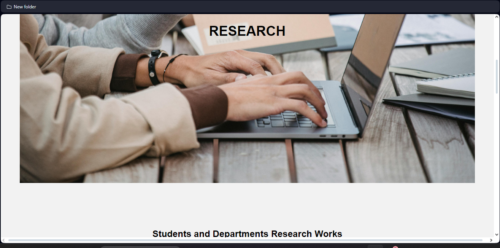
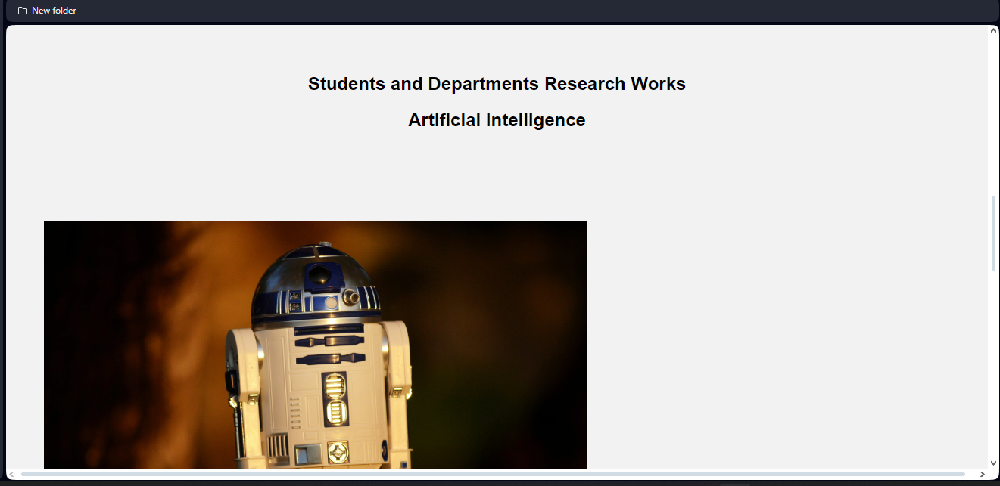
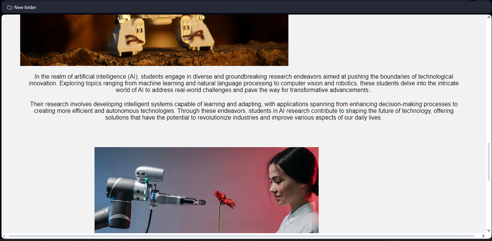
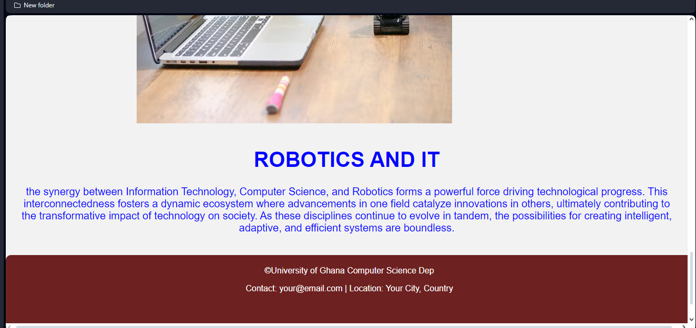
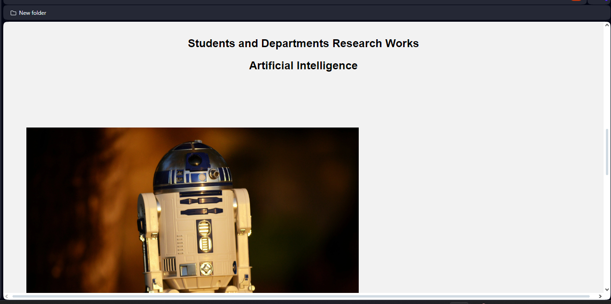
#### Above is the research webpage🤌

## PROGRAMS
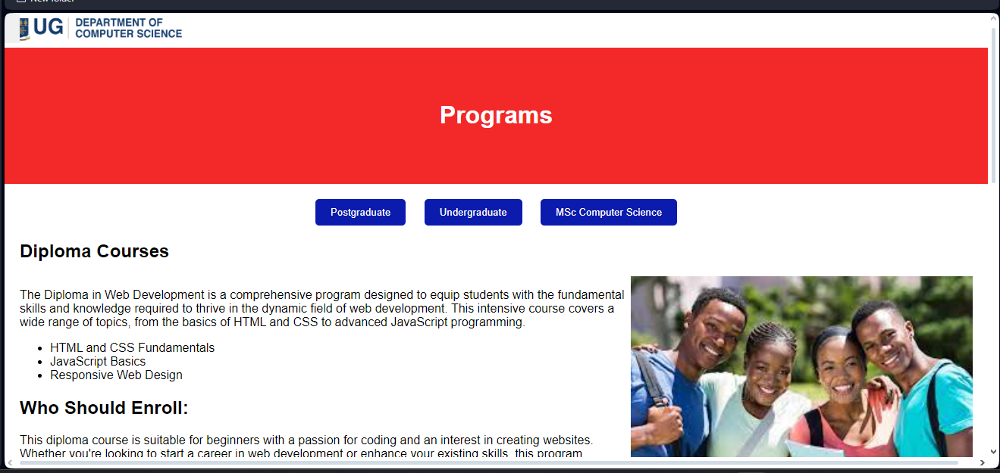
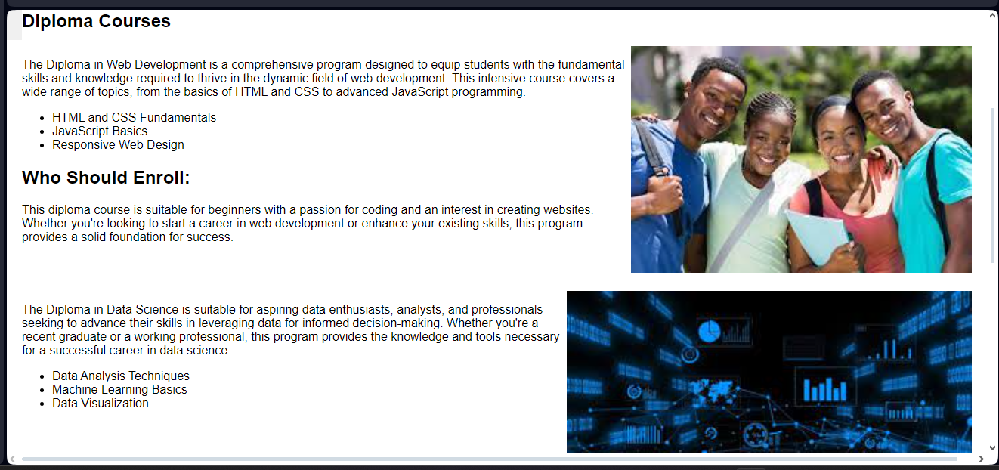
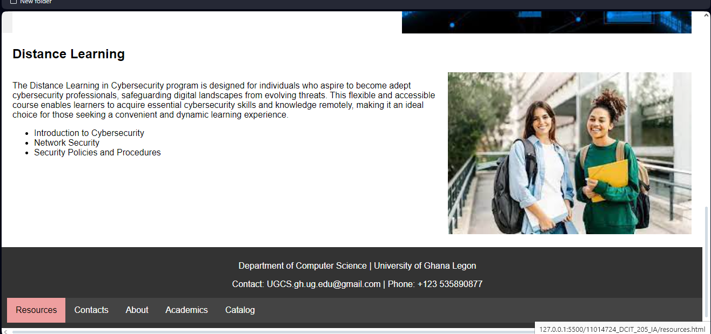

## ABOUT
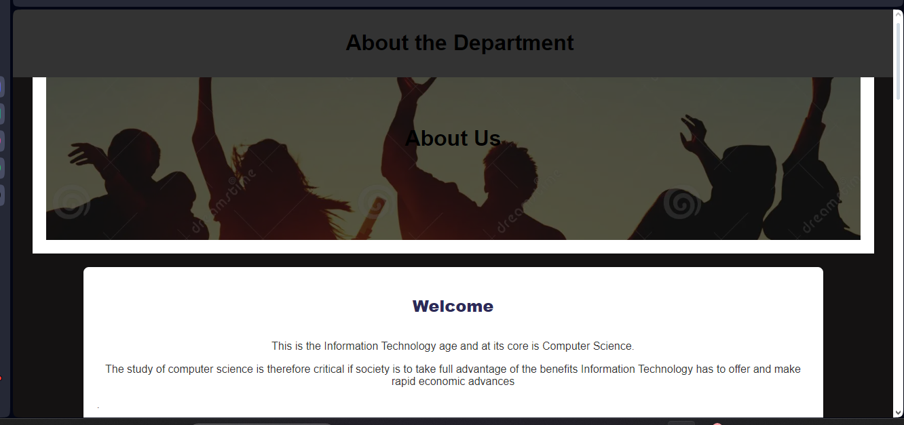
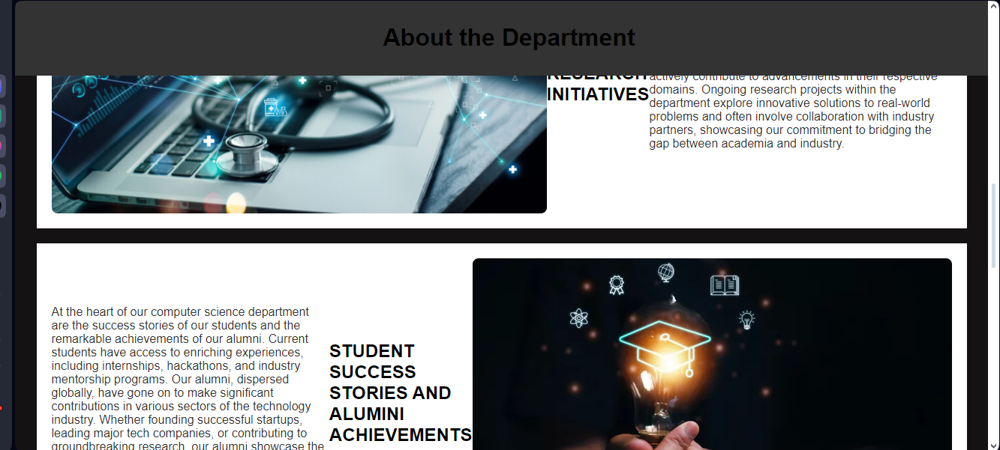
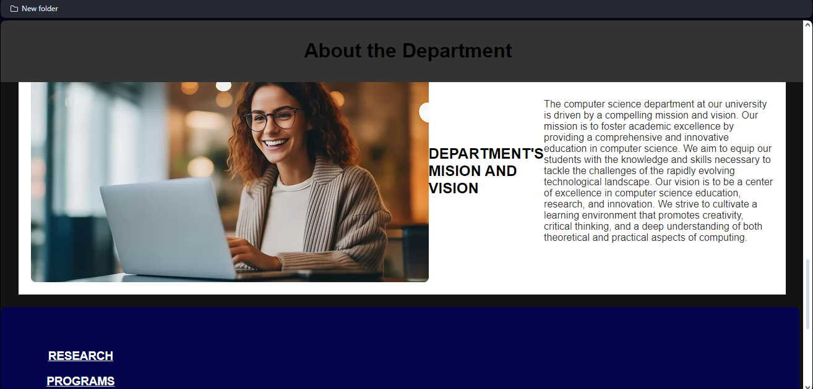
>>>>>>> a2b7363204a1280fae0033899bf8684419c1a348

